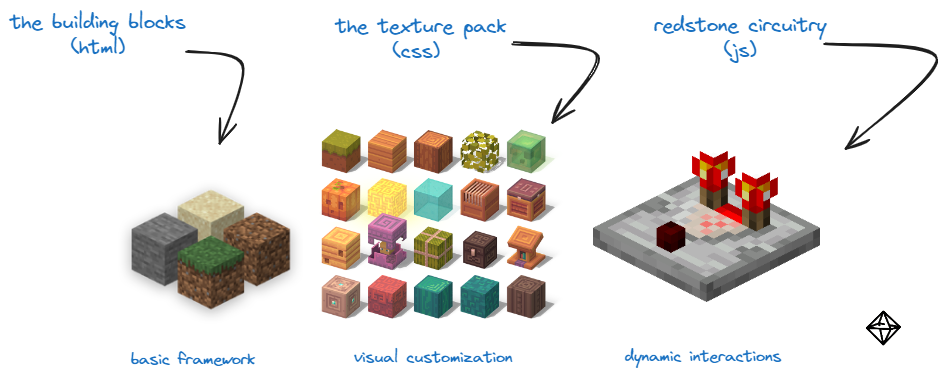
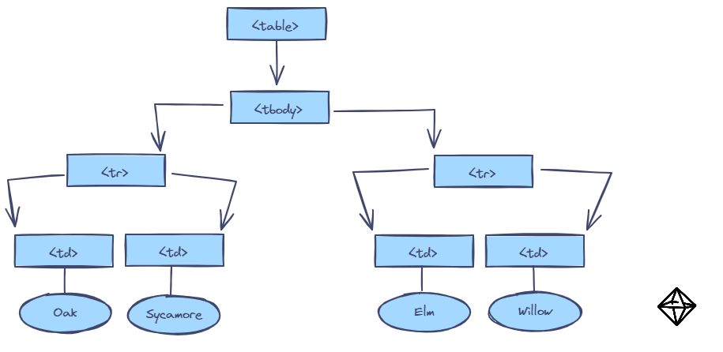

>[!Question] An introduction?!
> We think it's important to understand the context and functionality of a language before delving into it. This way, you're familiar with the reason the entire language was built, its use cases and practicality, as well as its historical and linguistic evolution! <br><br> In the case of JavaScript, there are quite a few concepts you should familiarize yourself with prior to taking a dive into it. This is because understanding the web-related theory underpinning JavaScript is advantageous when considering general front-end development. More on this will be discussed later.

## What is JavaScript?
[**JavaScript**](https://www.javascript.com/) is a [high-level](https://en.wikipedia.org/wiki/High-level_programming_language#:~:text=Examples%20of%20high%2Dlevel%20programming,low%2Dlevel%20are%20inherently%20relative.) scripting/programming language used to integrate complex features on websites. Among a few other languages you may recognize — Python, SQL, C#, and JavaScript are some of the most utilized programming languages in the world. In fact, JavaScript *<u>is</u>* the most utilized language globally! Now, why is that the case? What makes JavaScript so special? 

Created for the first [browser war](https://en.wikipedia.org/wiki/Browser_wars) in the mid-1990s, JavaScript was a programming language dedicated to driving the now-discontinued [Netscape Navigator](https://en.wikipedia.org/wiki/Netscape_Navigator) web browser ahead in the race against its rival, Microsoft's Internet Explorer.

>[!abstract] Did you know?  
> JavaScript was originally called LiveScript, but was renamed to JavaScript to capitalize on the popularity of Java. The initial prototype of JavaScript, *Mocha*, was developed by Brendan Eich in just ten days!

## Front-End Development
You might be familiar with HTML and CSS, two languages that provide the structure and style for web pages, respectively. HTML lays out the foundation and content of a webpage, while CSS enhances its appearance with colors, layouts, and fonts.

Where does JavaScript tie into all of this? Well, JavaScript adds interactivity and dynamic behavior to your web pages. It allows you to create engaging user experiences by enabling features like form validations, interactive maps, dynamic content updates, animations, and much more. While HTML and CSS make your webpage look good and structure it well, JavaScript brings it to life, making it responsive and interactive.

Perhaps this analogy I made to this random game I found online that might make sense to you.
> </img>

### How Are They Interconnected?
Within the main HTML file you create (commonly called index.html), the CSS styling sheet and the JS script that you want to be interconnected must be specified within this file. An example of this can be seen below. 

```
<!DOCTYPE html>
<html lang="en">
<head>
    <meta charset="UTF-8">
    <meta name="viewport" content="width=device-width, initial-scale=1.0">
    <title>HTML with Linked CSS and JavaScript Files</title>
    <link rel="stylesheet" href="styles.css">  # Connecting HTML to the CSS file named 'styles'
</head>
<body>
    <div class="container">
        <h1>Welcome to My Web Page</h1>
        <p>This page demonstrates linking external CSS and JavaScript files.</p>
        <button id="colorButton">Change Background Color</button>
    </div>

    <script src="script.js"></script> # Connecting HTML to the JS file named 'script'
</body>
</html>
```
### The Document Object Model
The Document Object Model (DOM) is an **object** and **application programming interface** (more on these later!) that embodies the page you see on a webpage. Through this model, anything that was built inside of an HTML file can be modified, deleted, or added to. Whenever the web browser loads an HTML document, the DOM is created. All elements that were employed in the HTML document are formatted into a grove-like orientation (formally called a *structure model*). JavaScript is able to access the DOM and add dynamic modifications the the webpage. 

That was a lot of words. Let's look at an example (inspiration taken from [here](https://www.w3.org/TR/WD-DOM/introduction.html)).

```
<!DOCTYPE html>
<html lang="en">
<head>
    <meta charset="UTF-8">
    <meta name="viewport" content="width=device-width, initial-scale=1.0">
    <title>Simple Table Example</title>
</head>
<body>
    <table>
        <tbody>
            <tr>
                <td>Oak</td>
                <td>Sycamore</td>
            </tr>
            <tr>
                <td>Elm</td>
                <td>Willow</td>
            </tr>
        </tbody>
    </table>
</body>
</html>
```

If you aren't familiar with HTML, this is a basic 2x2 table, where each row is represented by 'tr' and each entry by 'td.' When we look at the DOM structure model, we see how these objects are laid out.

> </img>

Every component in that image is treated like an "object" in JavaScript, which can then be manipulated to the user's liking.

## Static and Dynamic Code Analysis
The distinction in the form of programming that we are doing when we incorporate JavaScript into a simple HTML and CSS code is a transition from what we call *static content* to *dynamic content*.

* Static Content: When we use only HTML and CSS, the content of the web page is static. This means that the content and style are fixed and do not change in response to user actions or other inputs. The page looks the same every time it is loaded.

* Dynamic Content: When we add JavaScript, we enable dynamic content. JavaScript allows the web page to interact with the user, respond to events, and update the content dynamically without needing to reload the entire page. This transition makes the web experience more interactive and engaging.

## Frameworks and Supersets
Chances are that if you've heard of JavaScript, then you've heard of several other terms associated with it. You might be familiar with *React*, or *Node*, or maybe even *TypeScript*

## Conclusion
I'm happy you made it here! That was a lot to cover for just an introduction to a programming language, but we think it's key to know the groundwork before diving into the learning, especially for a language like JavaScript. With that being said, now is a good time to start learning. Choose any of the lessons of your choice available in the dropdown menu under 'JavaScript.'

```enjoy!```