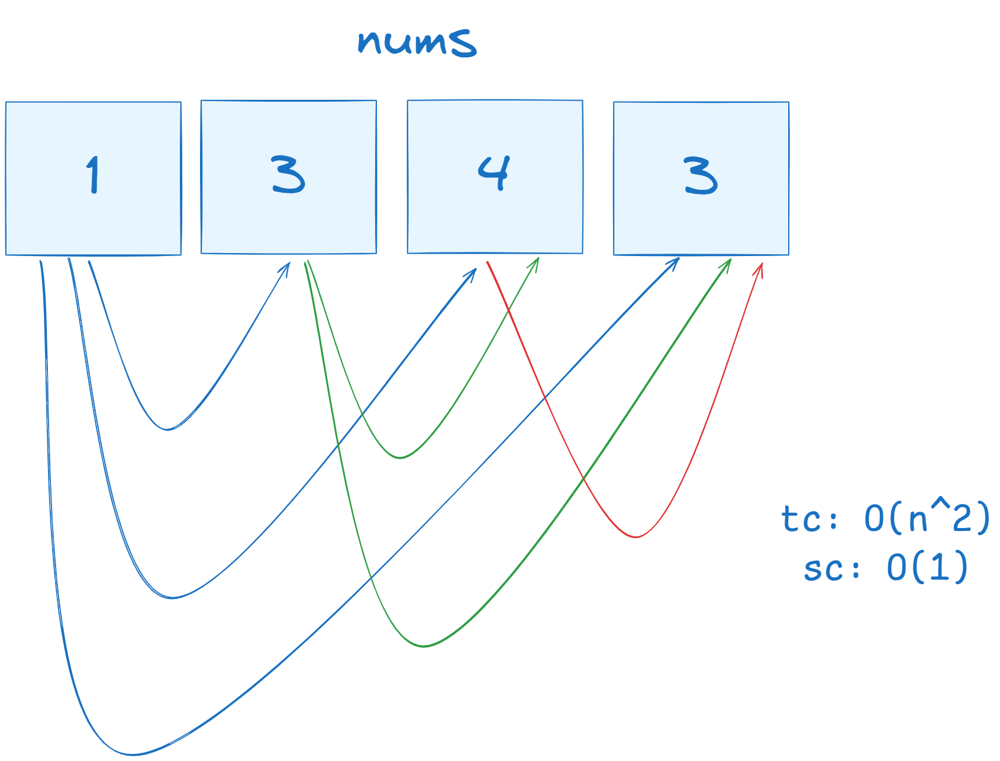
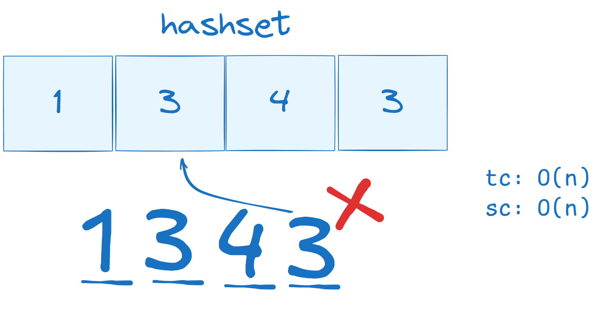
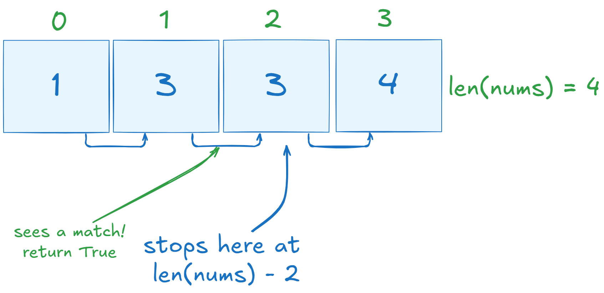

## Problem

Contains Duplicate is an **easy** level problem, and is #217 on Leetcode. For the full description, see [here](https://leetcode.com/problems/contains-duplicate/description/).
In Contains Duplicate, you are given an array `nums`, with which you must determine whether the array contains a duplicate integer. If it does, return `True`, and if every element is unique, return `False`.

This problem is straightforward if you are familiar with **sets**. Sets in Python are one of four data collection types that allow you to store multiple items in a single variable. Sets are both unindexed and unordered, with an additional property not allowing for duplicate members; which is the key to this problem.

By generating a set and assigning all values of the `nums` array to be appended to it, we can simply check if each index of the array already exists within the set. If so, we return `True`, otherwise, we return `False`.

## Approaches

There are a few ways to solve this problem given you work around different time and space complexities. One approach we can think of is a "brute force" method.

### Brute Force

Say we have an array, `nums`, containing the integers: `[1,3,4,3]`. This array clearly contains a duplicate 3, but how can we indicate that to the computer? If we take a look at a "brute force" method, we might think to compare each integer to every other integer, which could be represented by the following image.

<div style="text-align: center;">
    
</div>

The issue with this approach is that requires for each integer to be checked with every subsequent integer, producing a time complexity of O(n<sup>2</sup>). While the space complexity stays at O(1), it is still not the best option we have.

### Sorting

Another approach we could use is a sorting algorithm. By sorting the list in increasing order, any duplicate values would be placed in adjacent indices. For example, given the previous array `nums = [1, 3, 4, 3]`, sorting it results in `nums = [1, 3, 3, 4]`. This method offers an improved time complexity of O(n log n), which is typical for sorting algorithms. While this approach maintains a space complexity of O(1), it _still_ isn’t the most efficient solution. In some programming problems, it is better to **sacrifice** space complexity to improve time complexity, and this holds true for our case.

### HashSet

The most efficient solution to this problem involves using HashSets. Since sets do not allow duplicate values, this makes detecting duplicates much simpler. By developing an algorithm that checks whether the current integer already exists in the set, we can easily identify duplicates. While HashSets improve time complexity, they do require more memory, resulting in both time and space complexities being O(n).

<div style="text-align:center;">
    
</div>

Using our example, when we reach the final integer, 3, the set will recognize that 3 is already present, thereby identifying and excluding the duplicate.

## Program

The program begins as so:

```python
class Solution(object):
    def containsDuplicate(self, nums):
```

Underneath the `containsDuplicate` function is where we write our solution (to the HashSet approach). Our first step is to create an empty set using the set constructor that we will name `hashset`.

```python
hashset = set()
```

Next is to iterate through the `nums` array and check if each respective element already exists in the set, and if so, return True.

```python
for num in nums:
    if num in hashset:
        return True

return False
```

Altogether, the most optimal solution to Contains Duplicate is the following program:

```python
class Solution:
    def hasDuplicate(self, nums: List[int]) -> bool:
        hashset = set()

        for num in nums:
            if num in hashset:
                return True

            hashset.add(num)

        return False

```

### Bonus

As an exercise (for myself), I'm also going to be going over the sorting solution mentioned [[Leetcode-Walker/Arrays--and--Hashing/Contains-Duplicate#sorting|above]]. This solution is also simple in Python, taking advantage of the `.sort()` method. This solution checks if the current integer is equal to the _next_ value in the list.

The first step is to sort the list.

```python
nums.sort()
```

Instead of iterating through each integer in `nums`, like we did for the previous solution, we instead want to iterate through the indices themselves. Since we are looking to compare each value to the next one, we want to be careful of an index error. For this reason, we will be indexing from `0` to `len(nums) - 1`, which goes ends at the second last item of the list (exclusive property of `range`).

We don't want the last value of the list to be compared to the "next" as that does not exist, so we end at the penultimate entry.

<div style="text-align:center;">
    
</div>

Knowing this, our next lines of code are as following:

```python
for i in range(len(nums) - 1):
    if nums[i] == nums[i + 1]:
        return True

return False
```

Bringing it together, the sorting algorithm solution to this Leetcode problem is:

```python
class Solution(object):
    def containsDuplicate(self, nums):
        nums.sort()

        for i in range(len(nums) - 1):
            if nums[i] == nums[i + 1]:
                return True

return False
```

### Conclusion

The Contains Duplicate problem demonstrates the importance of understanding time and space trade-offs when solving algorithmic challenges. While brute force approaches can solve the problem, they often come with inefficient time complexity. By leveraging data structures like HashSets, we can significantly optimize our solutions, making them both faster and cleaner. This problem is a great example of how thinking about the right tool for the job—in this case, sets—can lead to better, more scalable solutions in coding.

```
writer: maheer :o
```
